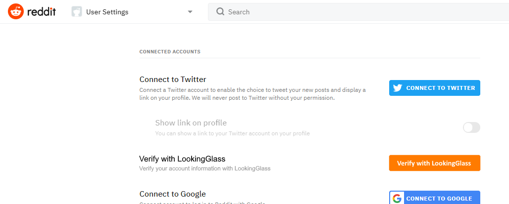
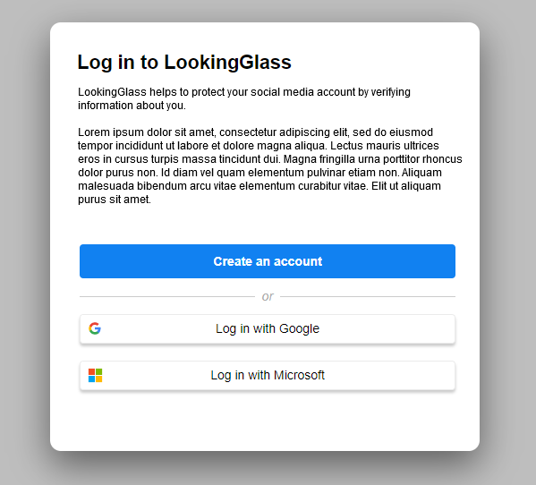
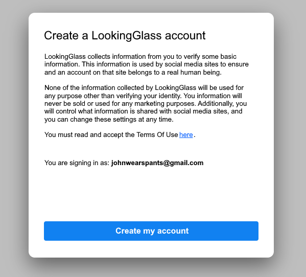
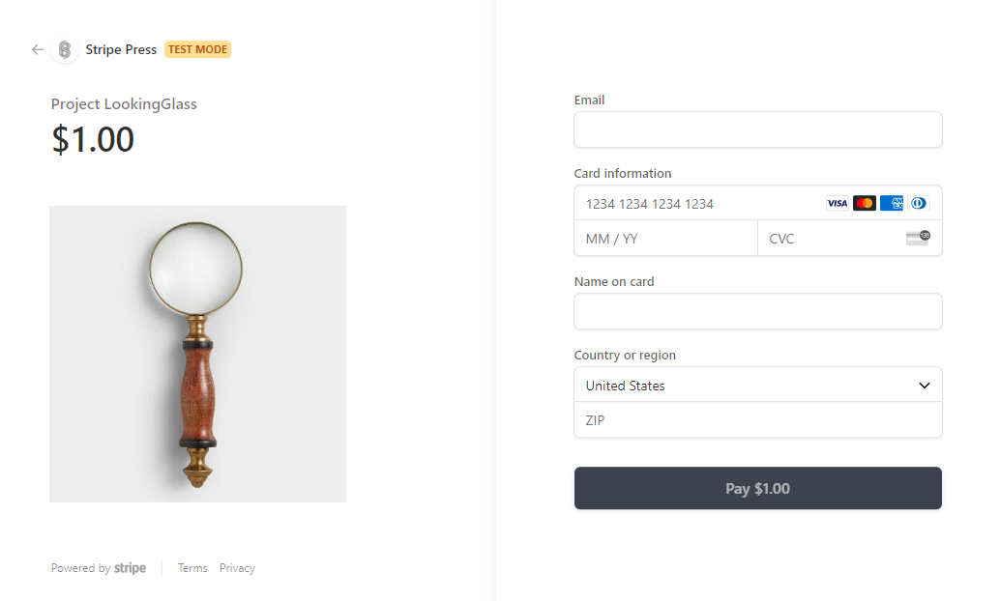
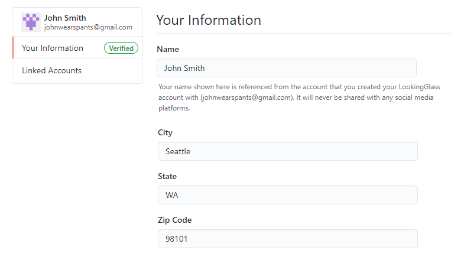
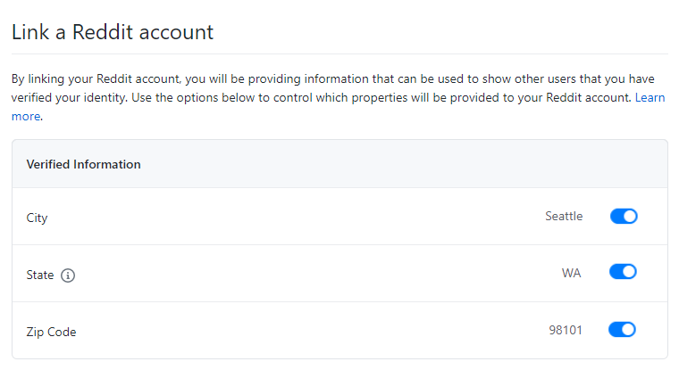
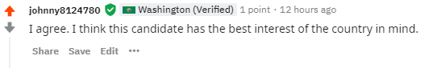

# Project LookingGlass

Anonymity is one of the most valued tenets of the Internet. It allows people to talk openly and seek out knowledge that would otherwise not be possible or permitted. However, that same anonymity allows others with nefarious intentions to pervert the truth, often by claiming to be something that they are not. This activity has grown dramatically in the last few years with disinformation campaigns aimed at changing public opinion.[1](https://www.jstor.org/stable/26508115?seq=1) [2](https://www.aeaweb.org/articles?id=10.1257%2Fjep.31.2.211&fbclid=IwAR04My3aiycypMJKSI58e84gDvdrodsB9fqCycH9YfepWDDDwT--fZnVPvo;%20https://www.nyu.edu/about/news-publications/news/2019/january/fake-news-shared-by-very-few--but-those-over-65-more-likely-to-p.html) [3](https://www.tandfonline.com/doi/abs/10.1080/10584609.2019.1661889)

The most straightforward solution to the disinformation problem is for social media platforms to establish the identity of their users. By requiring identity verification, the platform attempts to create credibility by ensuring that an account belongs to a person (and sometimes a _specific_ person). Twitter has employed account verification for notable accounts on their platform, though that system has been often criticized.[4](https://mashable.com/2017/11/09/heck-yeah-twitter-verification-is-broken/) While this can establish user credibility, it does so at the expense of the user's anonymity. For some users this may be acceptable, but for many it will not.[5](https://www.emerald.com/insight/content/doi/10.1108/S2398-601820180000002002/full/html) By eroding this anonymity, the number of users willing to engage on that platform will be decreased and the quality and quantity of the content will be similarly affected. 

Verifying the identity of a _specific_ user is a non-trivial process, often requiring a manual review of documents which must be validated. For platforms with millions of users, this type of solution cannot be scaled in a cost-effective way.

Project LookingGlass intends to solve disinformation using identify verification, but without impacting a user's anonymity and using methods that scale to meet the demands of hundreds of millions of users. This is possible by focusing on account verification and what it accomplishes, then decoupling the verification process from the social media account itself.

## How It Works

Project LookingGlass works by allowing users to create accounts which can prove a _degree of credibility_, then allowing social media platforms (hereafter referred to as 'platforms') to reference this information in a way that relays a user's authenticity without disclosing the user themself. Users will create a LookingGlass account, provide verification, then link their LookingGlass account to their social media account. The link serves as a way that a platform can establish trust with the person, using LookingGlass as a trusted intermediary.

>Note that a LookingGlass account is not a replacement for the account on the platform. LookingGlass 
>accounts are not to be trusted by the platform as a way of authorizing to that platform.

Identity verification must be easy enough for _the vast majority_ of people to accomplish yet reliable enough that the credibility of the verification can be made reliably. Also, the verification process must be fully automatable and provide relative certainty that there is one (and only one) person associated with the account.

Because identity verification is managed by project LookingGlass, the user is not providing any personally identifiable information (PII) to the social media platform. This allows the user to control what PII (if any) is provided to the platform through the account link. Additionally, project LookingGlass does not store any information from the user's account on the platform. The result is that neither the social media platform nor Project LookingGlass possess enough information build the list of social media accounts (and their content) on their own. Even in the event of a complete compromise of a site's data (either the platform or Project LookingGlass), it cannot be determined which social media accounts belong to a LookingGlass account. Doing so would require non-public information from both sources (the platform and Project LookingGlass). This is how user anonymity can be assured.

To facility integration, the platform will expose an option for users to link their platform account with their LookingGlass account. 
During the linking, the user will be given the choice of which pieces of verified information they will provide to the platform. 
Upon the user accepting, a `handle` will be created LookingGlass. 
The `handle` links the LookingGlass account to the platform account without exposing the LookingGlass account itself. 
This level of indirection allows the platform to query the account status at any time, and LookingGlass can attest to the validation status of the account (which may change over time).

Users often have multiple social media accounts on a given platform, typically with a different persona associated with each. This is a commonly used way for users to maintain a level of anonymity. To align with this, users will have a different `handle` that links back to the LookingGlass account for each account on the platform. This ensures the social media platform cannot connect two accounts as belonging to the same person.

### Verification and Reputation

In contrast to previous approaches, Project LookingGlass does not rely on identity verification to definitively identify a specific person. 
Rather, identity verification has two major aspects:
* Verification should be something that is easy for a person to perform once (or twice), yet difficult to do many times.
* A verified account has a reputation associated with it, which can be influenced by the platform.

These two aspects together create a motivation for a person to protect the reputation of their account, and thus discourage bad behavior (trolling, posting illegal content, etc.). When a user violates the platforms rules, the platform can lower the accounts reputation via a call to LookingGlass using the `handle` as a reference. When the reputation is low enough, the platform may choose to suspend the posting rights of the account. Because reputation is shared by all handles associated with the account, all other social media accounts linked to the same LookingGlass account will be lowered as well, and the user will be prevented from posting by all accounts on the platform. 

### Creating an account

To begin, a user will navigate to the Project LookingGlass site to create an account. 
Rather than managing user credentials itself, Project LookingGlass uses external identity providers (Microsoft, Google) via OAuth for user authentication. 

> For both security and privacy reason, Project LookingGlass relies on an external identity provider for user authentication. 
> This removes the need for storing any user credentials in Project LookingGlass as well as decoupling the LookingGlass account from the user's credentials.

During the creation of an account, no additional information is collected from the user. 
LookingGlass will store the user's unique ID from the identity provider (either a UPN or an opaque ID string), the identity provider used to sign up, and the email address associated with the account (for occasional account-related communication). 

In its initial state, the account is unverified. Before linking the LookingGlass account to a social media account, the user must perform account verification.

### Identity Verification

As discussed above, the identity verification process must be easy for a user to perform once or twice, but difficult to do many times. In the current design, there are two ways to perform verification:

* Using a credit card, making a small charge reoccurring ($1 every 3 months)
* Email verification from a specific set of domains (educational institutions/schools)

The primary way of performing identity verification is by credit card. After creating a LookingGlass account, the user will make a $1 USD payment via a online payment processor. 

> The proceeds from this transaction will be basis for funding the infrastructure used by LookingGlass (compute, storage, etc.). The expectation is that $1/user/3 months will be sufficient as the number of users grows and scale requirement for LookingGlass increase.

LookingGlass will collect the billing information (name, address, etc.) and charge the credit card accordingly. If the charge succeeds, the billing information will be saved for later re-use. The payment information (card number, expiration, CCV) will be handed by the payment processor and will never be visible to LookingGlass. On a three-month interval, LookingGlass will re-attempt the $1 charge. This allows for regular re-verification of the user's information. If the charge fails and the user does not correct the issue within a grace period, the account will be marked as 'no longer verified' and will be reflected in the social media platform.

While a credit card is an acceptable hurdle for the majority of adults, adolescents likely will not be able to perform this type of verification. For these users, they will be able to perform email verification using an email address from a specific set of whitelisted domains (middle & high schools). This will allow young adults the ability to have a verified account yet is unlikely to be able to be used more than once (since schools only assign one email address per student).

### Verified Data

In addition to verifying the user, LookingGlass allows _some_ of the user's information to be exposed to the social media platform (at the user's discretion), including the following:
* Country
* State/Province
* City

These values are recorded during the identity verification process, either from the billing information provided by the user or from the physical location of the school. The user can view the value on their LookingGlass account, but cannot modify them.

When a handle for a social media account is created, the user is provided with a list of data that they can choose to expose, along with their current values. 
The user can opt to prove all, none, or a subset of the data, but cannot change the values provided.

### Reputation

Reputation is a measurement of quality of the account, using a scale of 0 - 10. When an account is created, it is assigned the highest quality by default (10). If the user breaks a platform's rules or engages in behavior that the platform deems unacceptable, the platform can 'demote' the reputation of the account. This happens by the platform issuing a call to LookingGlass to demote an account, using the handle as reference. While the platform does not know the account, any changes to reputation made to a handle are made on the account, thus affecting the reputation of _all_ handles linked to the account.

The reputation of the account is exposed via the handle information, which the platform can query at any time. Reputation can be lowered for any reason by the platform - it is the platform's discretion to decide on lowering it. Raising reputation can only be done by reversing a previous lowering action; the platform cannot proactively raise the reputation of an account. However, reputation will slowly raise over time (1 point/month), so even an account with a poor reputation history will eventually recover.

Platforms can leverage reputation as a way to curtail bad behavior. For example, a platform may decide that accounts with a reputation below 7 cannot create new discussion topics, and accounts with a reputation below 4 cannot post comments. This can be further extended by having different thresholds for different areas of a platform, at the platforms discretion.

Because the reputation is reflected across all handles, a user cannot simply create another account on the social media platform and link it to their LookingGlass account, since this will result in the new account having the same reputation as their existing accounts. This design encourages verified users 

To prevent abuse, limits are placed on the number of times reputation can be demoted for an account (once per day, for example). This ensures that a single incident does not immediately ruin the reputation of an account.

## Value for the Social Media Platform

Enabling the use of a LookingGlass-linked account on a social media platform is no small effort and with require design and engineering to accomplish. However, the benefits of successful growth of verified accounts will outweigh the cost over the longer term. A social media platform that integrates with LookingGlass can expect to reap the following benefits.

#### Content from verified users is more trustworthy

Regardless of how easy verification is, many users will not want to go through the verification process, either because they do not want to or can't meet the requirements. This is especially true during the early phases of adoption when most accounts on the platform will not be verified. To differentiate verified users, the platform can opt to give users a 'flair' indicating that the account is verified, similar to Twitter's blue checkmark. This lets other users know that the content posted by this account belongs to a person that has provided verification.

#### Content from verified user has a higher quality

Because verified users can have their reputation shared among all of their linked account, there will be an implied consequence for bad behavior on a single account. This encourages the user to be considerate with their content.

#### Trolling can be significantly reduced

One of the most difficult challenges in social media is trolling.

> A troll is a person who starts flame wars or intentionally upsets people on the Internet by posting inflammatory and digressive, extraneous, or off-topic messages in an online community (such as a newsgroup, forum, chat room, or blog) with the intent of provoking readers into displaying emotional responses and normalizing tangential discussion, either for the troll's amusement, or to achieve a specific result such as disrupting a rival's online activities or manipulating a political process.[6](https://en.wikipedia.org/wiki/Internet_troll)

Project LookingGlass is a powerful tool to fight online trolling. As the number of verified accounts on a platform grows, the platform can begin to impose restrictions on non-verified accounts. For example, non-verified account may be required to wait a period of time before comments or posting  or have a maximum number of comments that they can make until the account is sufficiently old. Conversely, the platform an choose to allow a new account that is linked to LookingGlass to immediately begin commenting and posting. This is possible because the platform has the ability to penalize the user if the new account is used for nefarious purposes.

#### Requirements can be made for specific groups

Disinformation on the Internet has grown to become possibly the greatest threat to social media in recent years, eclipsing even trolling. Entities ranging from individuals to organizations to nation-states can create numerous social media account for generating content designed to change public opinion. This threat is challenging for social media platforms to curtail and has already had real-world impact.

A common element of disinformation campaigns is that the perpetrators typically are not in the same geographical region as where they are creating content. For example, Russian interference in the 2016 US Presidential Election produced a very real impact in the physical world.[7](https://ieeexplore.ieee.org/abstract/document/8048615) Solving misinformation such as this is beyond the scope of a single solution, however a significant reduction can be made by establishing the verified location of the user submitting the content.

Approximate location information is gathered during verification and is regularly (every 3 months) re-verified. It would be significantly difficult for an entity wanting to engage in disinformation to verify a significant number of accounts, at least to the extent that they could be used to appear as a large number of users.

As an example of application, discussion groups focused on discussing politics could require users to make their verified State and Country available (as enabled by the platform). This would be displayed (for example) as 'flair' attached to the name of the account when creating a new posting or commenting on an existing post. Any users of the platform (verified or not) would then be able to see the Country and State of the posting user. For a misinformation campaign to succeed, the entity would need to verify not just a few accounts, but many accounts, more than would be reasonably possible given the need to obtain a credit card. Similarly, getting an email account from an educational institution would be difficult since both (the credit card company and the school) will want to verify the user before creating anything for them.

## Use Cases

To solidify the benefits of Project LookingGlass, the example below demonstrates how a user would create and verify and account, and how a platform would leverage the verified information. 

> The images below are mock-ups of the proposed design (using layout patterns from github.com) and are for illustrative purposes only.

We will start with our user John, who has an existing reddit account (johnny8124780). When he logs into his account, he can see an option to verify his account by linking it with LookingGlass.

By clicking on the link, he is redirected to the LookingGlass site. If John already had a LookingGlass account, he would be able to log into it here. However since he does not, he will click to create a new account.

He will be given a choice of identity providers (Microsoft, Google) to sign in with. After signing in, he will be redirected back to LookingGlass to create his account. No additional information needs to be collected in order to create the account, and a short paragraph is given to explain how his data is used.

Once the account is created, he will be taken to his account page. On that page, he will be able to see his verification status (which is initially un-verified) along with any social media sites he has linked them to (none initially).

Before he can link his LookingGlass account to a social media account, he will need to verify his account. The recommended way to do this is via a small credit card payment. John clicks on the 'Verify my account' button, and it taken to a payment checkout page.

After completing the payment, John is redirected back to his account page on LookingGlass where he can view his information.

Now that the account is verified, it can be linked to John's social media account on Reddit. John clicks on the the "Linked Accounts" tab on the left, then clicks on a button to create a link with a Reddit account. Because John is already logged into his Reddit account, he is immediately shown a page to link the accounts, including the information that he can choose to provide to Reddit.

Once the link is created, all of John's posts and comments on his johnny8124780 account will be displayed with a 'verified' badge.

The platform can also choose to show all previous content made with that account as verified, at its discretion.

## Conclusion

Project LookingGlass goes a long way to solving issues that come with anonymity on the Internet. It provides a mechanism for ensuring that users on a social media site can believe that the content they are viewing wasn't created by someone purporting to be their neighbor, and it encourages a thoughtful and meaningful exchange of ideas without exclusion.
